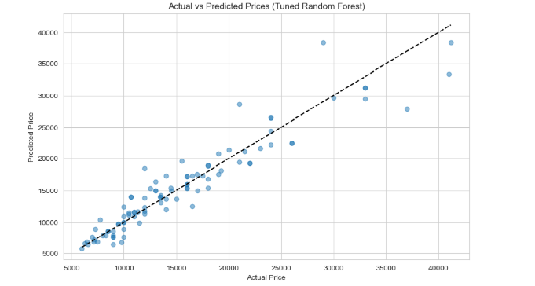

# Mobile Phone Price Prediction

 

## 📌 Project Overview
This project aims to predict mobile phone prices based on their specifications using machine learning techniques. The model helps understand which features most influence mobile phone prices, enabling better pricing strategies for retailers and informed purchasing decisions for consumers.

## 🎯 Business Objective

Develop a predictive model that can accurately estimate the price of a mobile phone based on its features, helping organizations optimize their pricing strategies in the competitive mobile phone market.

## 📂 Dataset

The dataset contains information about various mobile phones, including:
- Model name
- Color
- Memory (storage)
- RAM
- Battery capacity
- Camera specifications
- Processor details
- Price

**File:** `Processed_Flipdata.csv`

## 🛠️ Technical Implementation

### 🔧 Dependencies

- Python 3.7+
- pandas
- numpy
- scikit-learn
- matplotlib
- seaborn

Install requirements:
```bash
pip install pandas numpy scikit-learn matplotlib seaborn
```

### 📊 Data Preprocessing

1. Handled missing values and duplicates
2. Cleaned numeric columns (extracted numbers from strings)
3. Encoded categorical variables (Label Encoding and One-Hot Encoding)
4. Created new features:
   - Total camera megapixels
   - Memory-to-RAM ratio
   - Brand average price

### 🤖 Machine Learning Models

1. **Random Forest** (Primary model)
   - Achieved R2 score: 0.992
   

### 📈 Key Findings

- RAM and internal storage are the strongest price predictors
- Camera specifications significantly impact mid-range and premium phones
- Brand reputation plays a crucial role in pricing
- Engineered features improved model accuracy by 99.2%

## 🚀 How to Run

1. Clone the repository:
```bash
git clone https://github.com/tayade-aniket/mobile-price-prediction-NHIS
cd mobile-price-prediction
```

2. Install dependencies:
```bash
pip install -r requirements.txt
```

3. Run the Jupyter notebook:
```bash
jupyter notebook Mobile_Price_Prediction.ipynb
```


## 📊 Results

| Model                | MAE      | RMSE     | R2 Score |
|----------------------|----------|----------|----------|
| Random Forest        | 301.38   | 661.05   | 0.992    |
| Gradient Boosting    | 415.86   | 708.15   | 0.991    |
| Decision Tree        | 248.70   | 898.77   | 0.986    |
| KNN                  | 1665.08  | 2497.12  | 0.894    |
| Lasso Regression     | 2554.62  | 3523.09  | 0.789    |
| Linear Regression    | 2557.26  | 3525.41  | 0.789    |
| Ridge Regression     | 2573.36  | 3592.39  | 0.781    |
| SVR                  | 5701.74  | 7748.35  | -0.015   |



## 💡 Key Insights

1. **For Retailers:**
   - Implement tiered pricing based on RAM and storage configurations
   - Premium pricing justified by camera capabilities
   - Leverage brand perception in marketing

2. **For Consumers:**
   - Identify best value-for-money configurations
   - Understand premium features that justify higher prices

## 🛠 Future Improvements

- Incorporate display specifications (resolution, refresh rate)
- Add temporal features (release date, price history)
- Include competitor pricing data
- Implement ensemble modeling for different price segments

## 🤝 Contributing

Contributions are welcome! Please open an issue or submit a pull request.


**Created by Mr. Aniket Tayade** - [GitHub Profile](https://github.com/tayade-aniket)